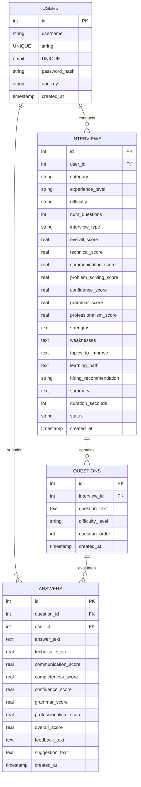
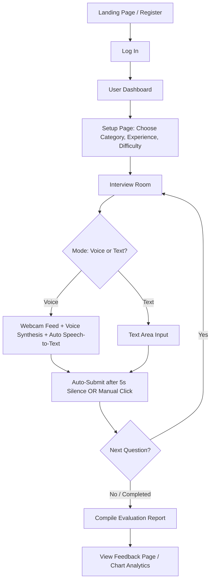

# InterviewIQ: Comprehensive Project Documentation

Welcome to the full documentation for **InterviewIQ**, a premium, AI-powered virtual interviewer application. This document details the system architecture, tech stack, database schema, user flow, and the precise implementation details of the application from start to finish.

---

## 1. Project Overview & Vision

**InterviewIQ** is an interactive web-based simulator designed to help job seekers practice technical and behavioral interviews. By combining modern web APIs with AI models, InterviewIQ acts as a real-time interviewer that:
*   **Asks Questions**: Verbally reads out role-specific questions.
*   **Listens to Answers**: Transcribes voice answers using browser-based Speech-to-Text (STT) or accepts text input.
*   **Automates Input**: Automatically submits answers after 5 seconds of silence/inactivity.
*   **Grades Performance**: Evaluates answers on multiple metrics (Technical Accuracy, Communication, Completeness, Confidence, Grammar, Professionalism).
*   **Generates Analytics**: Compiles a performance report complete with interactive radar charts, strengths, weaknesses, and a recommended learning path.

---

## 2. Tech Stack & Technologies Used

InterviewIQ is built with a lightweight, robust, and highly responsive technology stack:

### Backend
*   **Python (Flask)**: Serving the web application, handling API routing, managing session-based user authentication, and orchestrating database queries.
*   **Flask-Login**: Manages user authentication sessions, persistent logins, and route protection.
*   **SQLite**: A file-based SQL database for lightweight, self-contained storage of user profiles, interview sessions, questions, and evaluations.
*   **Cryptography (Fernet AES-128)**: Secures user-provided Gemini API keys symmetrically before storing them in the database.
*   **Google GenAI SDK (`google-genai` / `google-generativeai`)**: Connects to the Gemini 2.0 / 1.5 Flash models to generate context-aware questions and review candidate answers.

### Frontend
*   **Vanilla HTML5 & CSS3**: Structured layout with a custom styling system using CSS Variables. Features a glassmorphism dashboard, micro-animations, and responsive grids.
*   **Vanilla JavaScript (ES6+)**: Handles frontend state management, audio recording, webcam feeds, timer increments, speech recognition, and network requests.
*   **Web Speech Recognition API**: Captures voice input directly in the browser and transcribes it in real-time.
*   **Speech Synthesis API**: Generates realistic voice outputs to speak the interview questions out loud.
*   **Chart.js**: Renders interactive radar charts to visually display the candidate's metrics breakdown.

---

## 3. Database Schema

InterviewIQ uses an SQLite database (`interviewiq.db`) structured with four primary tables:



---

## 4. Complete Application Flow

The user journey in InterviewIQ goes through the following distinct stages:



### 1. Registration & Authentication
*   Users create a local account with a username, email, and password. Passwords are safe-hashed using PBKDF2.
*   Once logged in, they can configure a personal Google Gemini API key under **Settings**. This key is encrypted in Python using the `cryptography` library and stored securely in the database.

### 2. Configuration & Parameter Setup
*   Before starting, candidates select:
    *   **Category**: 12+ built-in roles (Python, Java, C#, SQL, JS, Full Stack, ML, Data Science, Customer Service, Marketing, Sales, HR) or a **Custom Topic**.
    *   **Experience Level**: Fresher, Junior, Intermediate, Senior.
    *   **Starting Difficulty**: Easy, Medium, Hard, Expert.
    *   **Question Count**: 5, 10, 15, or 20 questions.
    *   **Mode**: Voice (hands-free speaking) or Text (typing answers).

### 3. The Interactive Practice Room
*   **Webcam Preview**: Requests permission and displays a live selfie stream inside a styled container to simulate a real video-call setting.
*   **TTS Reading**: The application retrieves the next question, displays it in a chat bubble, and speaks it out loud.
*   **Active Listening & Autosubmit**: 
    *   Once the speaker ends, voice recognition activates automatically.
    *   As the candidate speaks (or types), the text area updates in real-time.
    *   An auto-submit timer triggers if there is a **5-second gap of inactivity** (silence in voice mode or typing pause in text mode), automatically submitting the answer to the server.

### 4. Grading & Final Report Compilation
*   When a response is submitted, it is immediately graded (via Gemini API, falling back to a stable 82-point mock evaluator if no API key is active).
*   Upon answering the last question, the backend automatically compiles a comprehensive aggregate report detailing weaknesses, strengths, an overall score, and a 3-step learning path. 
*   A print/save button lets candidates download their evaluation report as a clean PDF.

---

## 5. Implementation Details

Here is an analysis of how the core files function together:

### A. Web Server Routing (`app.py`)
This file is the primary entry point. It manages session authentication and exposes pages and JSON API endpoints:
*   `/dashboard`: Retrieves and displays a list of past interviews and cumulative score statistics.
*   `/feedback/<interview_id>`: Gathers the completed interview scores, loads the strengths/weaknesses/learning paths from JSON formats, and renders the evaluation page. If an interview was terminated prematurely or needs finalizing, it triggers a backend fallback auto-compilation.
*   `/api/start_interview`: Initializes the session record in the `interviews` table.
*   `/api/get_question`: Retrieves the next question. If it's the first question, it triggers Gemini (or Mock fallback) to generate it.
*   `/api/submit_answer`: Inserts the candidate's answer into the database, evaluates the individual response, updates progress metrics, and automatically triggers report generation on the last question.
*   `/api/end_interview`: Used when the user manually terminates the session early to compile partial performance reports.

### B. AI Engine Layer (`services/gemini_service.py`)
This service connects to the Gemini API using either the new `google-genai` SDK or falls back to the legacy `google-generativeai` SDK.
*   **Question Generation**: Incorporates the selected experience level, topic, and difficulty. It passes a history of already asked questions to prevent repetitions.
*   **Answer Evaluation**: Prompts the AI model to grade the text response against 7 performance indices, providing written suggestions and constructive feedback in a strict JSON format.
*   **Mock Fallback Data**: In Sandbox mode (no API key configured), the service supplies a pre-loaded question bank spanning all 11 core roles (with 10 detailed questions each) and applies a stable evaluation benchmark (82-point average) that evaluates short and long responses fairly.

### C. Live Interactive Frontend Script (`static/js/interview.js`)
This script coordinates state and event listeners in the virtual interview room:
*   `initWebcam()`: Captures camera frames using `navigator.mediaDevices.getUserMedia`.
*   `speakQuestion()`: Synthesizes spoken voice models using Web Speech Synthesis.
*   `initSpeechRecognition()`: Hooks into the WebkitSpeechRecognition subclass, mapping microphone streams directly to the input textarea value.
*   `resetAutoSubmitTimer()`: Tracks typing/speaking pauses. Clears and resets a 5-second `setTimeout` trigger upon every change in the input field, submitting the answer automatically when the user goes quiet.
*   `submitAnswer()`: Submits answers asynchronously via POST requests, updates progress bars, and transitions the state machine to the next question.

---

## 6. How to Run from Scratch

Follow these steps to deploy and run InterviewIQ locally:

1.  **Clone / Prepare Directory**:
    Verify that your workspace contains:
    *   `app.py`
    *   `schema.sql`
    *   `requirements.txt`
    *   `templates/` (UI layout screens)
    *   `static/` (CSS styles and JS logic scripts)
    *   `services/` (Gemini SDK connectors)

2.  **Install Dependencies**:
    ```bash
    pip install -r requirements.txt
    ```

3.  **Start the Server**:
    ```bash
    python app.py
    ```
    *(The SQLite database file `interviewiq.db` is initialized automatically on startup using the schema definitions in `schema.sql`)*

4.  **Practice**:
    Open [http://localhost:5000](http://localhost:5000) in Chrome/Edge, sign up, adjust settings, configure your video/mic, and start practicing.


